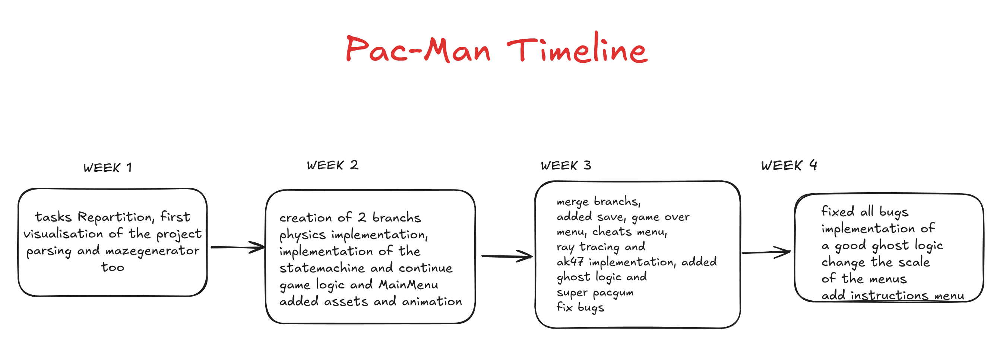

# Commits

commit 10544d56ec66f7314c8ffc960d65adb54092abea
Author: Corentin Bussiere <cobussie@z4r4p3.42lyon.fr>
Date:   Thu May 7 18:27:18 2026 +0200

    add package with already compiled game

commit 8fc9c0bc5c31ef77b366c0f25db47a4d0290a68d
Author: Corentin Bussiere <cobussie@z4r4p3.42lyon.fr>
Date:   Thu May 7 16:37:26 2026 +0200

    norm and docstrings

commit e32604c29a113a3ca0de1a166fb82669c1fbbedd
Author: Clement Rappo <crappo@z3r5p5.42lyon.fr>
Date:   Thu May 7 16:22:24 2026 +0200

    Review and fixed the README.md file

commit 23016e913e1b8ccc644da5e8b5c27bfd17c9b78c
Author: Clement Rappo <crappo@z3r5p5.42lyon.fr>
Date:   Thu May 7 16:08:18 2026 +0200

    Wrote the README.md file

commit cc6cf11f5d07b86c17390866abd5346834941ebb
Author: Corentin Bussiere <cobussie@z4r4p3.42lyon.fr>
Date:   Thu May 7 15:35:36 2026 +0200

    fix main menu leaderboard, some minor features too

 

Show more</strong>

commit 1c82aca13897fc55b033ec758533c28496829684
Author: Corentin Bussiere <cobussie@z4r4p3.42lyon.fr>
Date:   Thu May 7 13:40:26 2026 +0200

    add some norm

commit c9c81dfede6e4b2d5d469a9e0c1682363627639c
Author: cocoyolow <corentin7.bussiere@gmail.com>
Date:   Thu May 7 02:03:58 2026 +0200

    add instruction menu, fix bug where the lives where not kept when we change level, change color in PauseMenu

commit 9aa2cc287cd3a6a9ecdb2a15a474c48697d14ed8
Author: Corentin Bussiere <cobussie@z1r1p4.42lyon.fr>
Date:   Wed May 6 16:20:18 2026 +0200

    add the next player to beat and fix a bug when the ghosts are frozen

commit dfd8d9543efa4b3060a59beb6097656e4a74df76
Author: Corentin Bussiere <cobussie@z4r5p1.42lyon.fr>
Date:   Tue May 5 19:16:40 2026 +0200

    add the win meenu

commit 796ffe80bbc2886f320ac3e2b7b8bc2d6703efb3
Author: Corentin Bussiere <cobussie@z1r6p1.42lyon.fr>
Date:   Mon May 4 16:56:20 2026 +0200

    ghosts now flee when they see us during the super pagcum time

commit 7251440149a5c8cc5d9d56f19bc526bbe4373336
Author: Corentin Bussiere <cobussie@z4r6p1.42lyon.fr>
Date:   Thu Apr 30 18:12:10 2026 +0200

    fix bugs

commit 8f295ff02dd5c4eaca9dfcab0e226a7d7afee4ed
Merge: 5e39256 58f14ba
Author: Clement Rappo <crappo@z1r1p1.42lyon.fr>
Date:   Wed Apr 29 15:30:13 2026 +0200

    Update

commit 58f14ba696d94604be054a82d1162a034ecc6af3
Author: Clement Rappo <crappo@z1r1p1.42lyon.fr>
Date:   Wed Apr 29 15:29:13 2026 +0200

    Update

commit 5e39256401430b5e88c34acf3e0c41b426b10778
Author: Corentin Bussiere <cobussie@z2r3p4.42lyon.fr>
Date:   Wed Apr 29 15:15:10 2026 +0200

    change the size of menus so it scales with the window size

commit 7860996d9cfceb4e2c3440d6fe1b5460c830b594
Author: Corentin Bussiere <cobussie@z3r2p3.42lyon.fr>
Date:   Tue Apr 28 16:17:09 2026 +0200

    fix when the ghost died, we cant kill it again until he respawns

commit 2be60cab0ac45134da9d104ed640e7ff06197f87
Author: Corentin Bussiere <cobussie@z3r2p3.42lyon.fr>
Date:   Tue Apr 28 16:03:27 2026 +0200

    fix: when the ghosts are frozen they coulndt be killed before

commit fad1ae4b3370a58d077fa75e1f40c13412f04d72
Merge: c20de07 6b14b4e
Author: Clement Rappo <crappo@z3r3p6.42lyon.fr>
Date:   Tue Apr 28 15:29:04 2026 +0200

    Merge time and main

commit 6b14b4e809680846228df025a14b12184158baa6
Author: Clement Rappo <crappo@z3r3p6.42lyon.fr>
Date:   Tue Apr 28 15:20:19 2026 +0200

    Fixed something

commit c20de074200c4de1a13fe22bbc96424ebae50877
Author: Corentin Bussiere <cobussie@z3r2p3.42lyon.fr>
Date:   Tue Apr 28 15:17:59 2026 +0200

    add animation when the ghost dies

commit 6a2556a1617a79404c5993012fe726c4b1adc954
Author: Corentin Bussiere <cobussie@z1r1p1.42lyon.fr>
Date:   Mon Apr 27 16:25:21 2026 +0200

    use the correct reset function

commit 8cc93e98c9658190862db79b1424ffa4973b852d
Merge: 656e45a 8f16071
Author: Corentin Bussiere <cobussie@z1r1p1.42lyon.fr>
Date:   Mon Apr 27 16:04:58 2026 +0200

    merge

commit 656e45a3f6459bc512c1b695eb45c99c532a152a
Author: Corentin Bussiere <cobussie@z1r1p1.42lyon.fr>
Date:   Mon Apr 27 16:00:51 2026 +0200

    add level selection menu

commit 8f16071dfb9ccaf169f138c9c30ab3bc5ac62d63
Author: Clement Rappo <crappo@z1r2p5.42lyon.fr>
Date:   Mon Apr 27 15:58:04 2026 +0200

    Updated levels logic and linked cnofig variables with game variables

commit a4b9d5717928eca970622b9bb3ab59e528b3cd59
Author: Corentin Bussiere <cobussie@z1r1p1.42lyon.fr>
Date:   Mon Apr 27 14:25:29 2026 +0200

    remove pos x

commit ab093e58c61250e3ce0735d829100f9c60f65d70
Author: Corentin Bussiere <cobussie@z1r1p1.42lyon.fr>
Date:   Mon Apr 27 12:44:56 2026 +0200

    fix merge issue

commit 6c2b2ef5a9876f0c01a46b0dc39952f115cc1d29
Merge: 3b68afc cfc42f3
Author: Corentin Bussiere <cobussie@z1r1p1.42lyon.fr>
Date:   Mon Apr 27 12:43:04 2026 +0200

    merge all menu branch

commit cfc42f3a83a5a326d77ae001390322fa1ae27a81
Author: Corentin Bussiere <cobussie@z1r1p1.42lyon.fr>
Date:   Mon Apr 27 12:39:07 2026 +0200

    add interaction between bullets and ghosts

commit d645bbad053b93c08e69771e34299826a19bd233
Author: Corentin Bussiere <cobussie@z1r7p2.42lyon.fr>
Date:   Fri Apr 24 17:41:31 2026 +0200

    improve bullets

commit 7e84c90ceac0f45160aae481203b18fc2b216bf2
Author: Corentin Bussiere <cobussie@z4r4p2.42lyon.fr>
Date:   Thu Apr 23 17:40:13 2026 +0200

    update bullet physics

commit 3b68afc4b1f7a4e9e0179902ae2a8d5dad7e6cdf
Merge: b6d3fba 99ffda7
Author: Clement Rappo <crappo@z4r4p1.42lyon.fr>
Date:   Thu Apr 23 15:22:46 2026 +0200

    Merged with player_itbox branch

commit b6d3fba096f24fff51d790d1d033d1960417782a
Author: clemsRp <clement.rappo@edmu.fr>
Date:   Thu Apr 23 14:51:29 2026 +0200

    Saved the resize

commit ce1d358abb00b824b912c9d0902aeadbe4838642
Author: Corentin Bussiere <cobussie@z1r6p2.42lyon.fr>
Date:   Wed Apr 22 17:10:24 2026 +0200

    the ak is now drawn correctly and we can shoot bullets, it does nothing right now

commit 4597b39338cd4938c3edc3035e81a1273416f82f
Author: cocoyolow <corentin7.bussiere@gmail.com>
Date:   Wed Apr 22 14:46:21 2026 +0200

    start ak47, not working yet

commit 2c6e85f62c1300b63615b7ab35925343703be8e7
Author: Corentin Bussiere <cobussie@z1r6p2.42lyon.fr>
Date:   Wed Apr 22 13:29:28 2026 +0200

    add ak47 asset and fix bug with freeze ghosts

commit 22632dcac7253e3d7404764e4eb2d7baaa87fbf6
Author: Corentin Bussiere <cobussie@z3r7p5.42lyon.fr>
Date:   Tue Apr 21 17:27:50 2026 +0200

    add super pacgums

commit 569f135a0f986e91207349f8f3657a021ea89045
Author: Corentin Bussiere <cobussie@z3r7p6.42lyon.fr>
Date:   Mon Apr 20 16:47:20 2026 +0200

    improve ray tracing

commit 3795e970ddb1f0e4bb120a1da21c9d111d18b986
Author: cocoyolow <corentin7.bussiere@gmail.com>
Date:   Mon Apr 20 01:10:28 2026 +0200

    correct ray tracing .its now good and relatively performant

commit ed31d261e32bdba2cba7af6bcaf5f79845c4fdcd
Author: cocoyolow <corentin7.bussiere@gmail.com>
Date:   Mon Apr 20 00:47:11 2026 +0200

    improve performance of the ray tracing

commit 185369920e3ccf63326880af96ff052b88efc383
Author: cocoyolow <corentin7.bussiere@gmail.com>
Date:   Wed Apr 15 01:02:20 2026 +0200

    start ray tracing

commit 99ffda70149e0068083a130d9d4b49f31f2a13c8
Author: Clement Rappo <crappo@z3r5p6.42lyon.fr>
Date:   Tue Apr 14 14:57:49 2026 +0200

    Modify the display with an adaptable size

commit b7c29c68126ff381338685e3d285c742db6c4778
Author: Clement Rappo <crappo@z3r4p6.42lyon.fr>
Date:   Tue Apr 14 12:11:18 2026 +0200

    Fixed the interfaces error

commit 84198c45d79d82d9bf837292bc3b5fe331903f00
Author: clemsRp <clement.rappo@edmu.fr>
Date:   Tue Apr 14 08:13:59 2026 +0200

    update

commit d32f532656f19da220172b5f3ab8dec0a68c1971
Author: cocoyolow <corentin7.bussiere@gmail.com>
Date:   Mon Apr 13 17:51:35 2026 +0200

    feat: add remove collisions cheat

commit 9b87741a29f6f39479d6bbf1dc76a4b556e4c42c
Author: clemsRp <clement.rappo@edmu.fr>
Date:   Mon Apr 13 11:11:11 2026 +0200

    Updated the adaptive size of the gamelogic state

commit 8017f475a45105c997ad5df7021a6bb39c2cdd89
Author: clemsRp <clement.rappo@edmu.fr>
Date:   Sat Apr 11 17:52:50 2026 +0200

    Started to adapt sizes depending on the screen size

commit c8c5e78b7914cbdda855c0f92954d91c469ab4ae
Author: cocoyolow <corentin7.bussiere@gmail.com>
Date:   Fri Apr 10 17:53:39 2026 +0200

    implement bonus lives and invincibility

commit 33a3c0ffdc163543e4a6190f2f577ee45ee5b9ce
Author: Clement Rappo <crappo@z1r7p5.42lyon.fr>
Date:   Fri Apr 10 17:31:38 2026 +0200

    updated game over state

commit d2ed3070f1719fd25d9c99a0745b1b329a91d776
Author: cocoyolow <corentin7.bussiere@gmail.com>
Date:   Fri Apr 10 16:27:46 2026 +0200

    feat: add cheat bounding box in the pause menu

commit ff4e01babce59e0afff66f57b94cd1220042795b
Author: cocoyolow <corentin7.bussiere@gmail.com>
Date:   Fri Apr 10 00:44:50 2026 +0200

    feat: add Pause menu in GameLogic.py. the checkbox does not work for now but at least it can be checked

commit 3fe4ac46c03b635841dd1d60c8e487811c536202
Merge: 1b5531f 3fa3f79
Author: Clement Rappo <crappo@z4r8p1.42lyon.fr>
Date:   Thu Apr 9 16:07:01 2026 +0200

    fix merge conlict

commit 1b5531f59f7e34200e28aeebc1bf7d6f99ebfdb4
Author: Clement Rappo <crappo@z4r8p1.42lyon.fr>
Date:   Thu Apr 9 16:04:29 2026 +0200

    added skull

commit 3fa3f790fabee8094e6e41633a03e358a9f51e94
Author: Corentin Bussiere <cobussie@z4r8p3.42lyon.fr>
Date:   Thu Apr 9 15:30:45 2026 +0200

    there is now an animation for the circles on the mainmenu

commit 7305d77879183a91ebbb8134c32f0ff8241f1dda
Author: Clement Rappo <crappo@z4r8p1.42lyon.fr>
Date:   Thu Apr 9 15:25:01 2026 +0200

    Start of game over state

commit a62bab81d43d1c5054e1c15dd54abb3bc3e70c6b
Author: Corentin Bussiere <cobussie@z4r8p3.42lyon.fr>
Date:   Thu Apr 9 11:36:01 2026 +0200

    "center pacman and put scores"

commit 5ce8dca6a9f40500977e1c3c5152938096103fc1
Author: Clement Rappo <crappo@z4r8p1.42lyon.fr>
Date:   Thu Apr 9 11:35:23 2026 +0200

    correct merge

commit 937a3aa1044ea86563c34d7d60d2e86f9e4bffd2
Merge: cceff24 0d66ea9
Author: Corentin Bussiere <cobussie@z4r8p3.42lyon.fr>
Date:   Thu Apr 9 11:28:25 2026 +0200

    Merge remote-tracking branch 'refs/remotes/origin/all-menus' into all-menus

commit cceff2409e9838d7a69f988c092d8be34e87fb28
Author: Corentin Bussiere <cobussie@z4r8p3.42lyon.fr>
Date:   Thu Apr 9 11:18:33 2026 +0200

    put new assets

commit 16a150007c9ac9e120369325115ee06aacaf407c
Author: Clement Rappo <crappo@z4r8p1.42lyon.fr>
Date:   Thu Apr 9 11:26:15 2026 +0200

    merge

commit b40adad4646e01183a9c7ef924cfd9d91740fa2c
Author: Clement Rappo <crappo@z4r8p1.42lyon.fr>
Date:   Thu Apr 9 11:19:48 2026 +0200

    Centered the maze

commit 0d66ea98752ae5bbe1b6f75c84442307e0a6497e
Author: Corentin Bussiere <cobussie@z4r8p3.42lyon.fr>
Date:   Thu Apr 9 11:18:33 2026 +0200

    put new assets

commit 60376acf5e6e0547db127004bb45f362700df0c7
Merge: 4cf8b26 d609d08
Author: Clement Rappo <crappo@z4r8p1.42lyon.fr>
Date:   Thu Apr 9 10:20:39 2026 +0200

    Merge all-menus and main

commit d609d082f5d57c6435bd3f565998b8d8633e5184
Author: Corentin Bussiere <cobussie@z4r8p3.42lyon.fr>
Date:   Thu Apr 9 10:15:52 2026 +0200

    finish pacman anim

commit 63af1a11668b6c91a239f185320c40b2ff2291c2
Author: cocoyolow <corentin7.bussiere@gmail.com>
Date:   Thu Apr 9 00:50:49 2026 +0200

    feat: better sprites, in the main menu there is an animation of a pacman moving.

commit 13fafb16222753dd04a0579d5fc8349703a542cb
Author: Corentin Bussiere <cobussie@z2r4p7.42lyon.fr>
Date:   Wed Apr 8 17:27:15 2026 +0200

    continue MainMenu, start Background Pacman

commit 4cf8b26ba5231457f05a7965b7f90f1cd01ab636
Author: Clement Rappo <crappo@z2r3p8.42lyon.fr>
Date:   Wed Apr 8 17:07:51 2026 +0200

    Update

commit 6807782d2b33a9ddcc276b2d1867342f3a69ba20
Author: Clement Rappo <crappo@z2r3p8.42lyon.fr>
Date:   Wed Apr 8 17:04:58 2026 +0200

    Update

commit cbdc333e1668a44acf74a3d0bf1e1d00341fdd46
Author: Clement Rappo <crappo@z2r3p8.42lyon.fr>
Date:   Wed Apr 8 13:27:36 2026 +0200

    Modified the free texture

commit 8b4f1f5f00143d6058d3fc6a7323ad0c8b78f8d7
Merge: 872f709 2de1edc
Author: Clement Rappo <crappo@z2r3p6.42lyon.fr>
Date:   Wed Apr 8 12:50:56 2026 +0200

    merge

commit 872f7092a1ab0b0f3ab2d98fab45b7513337acca
Author: Clement Rappo <crappo@z2r3p6.42lyon.fr>
Date:   Wed Apr 8 12:48:41 2026 +0200

    Added the first ghosts

commit 2de1edc39ed397732ab8e3fe74738e4e8d21d70f
Author: Corentin Bussiere <cobussie@z2r4p7.42lyon.fr>
Date:   Wed Apr 8 12:48:14 2026 +0200

    add MainMenu and free_asset_function

commit a6c4e9efe7f774eebff14dac65c22f58c1b8cf41
Author: Clement Rappo <crappo@z2r3p6.42lyon.fr>
Date:   Wed Apr 8 11:11:58 2026 +0200

    Modified the assets system

commit 5557f514f0698406819fbbc8a27bfe574e662bdc
Author: Clement Rappo <crappo@z3r10p3.42lyon.fr>
Date:   Tue Apr 7 15:41:10 2026 +0200

    Modified a bit the animations

commit 468be44d110e33a13e675b8bc4bfbff6b2c82313
Author: Corentin Bussiere <cobussie@z3r11p6.42lyon.fr>
Date:   Tue Apr 7 15:29:16 2026 +0200

    Feat: Refactor

commit 91c1ba6c427516b245de9d4f65873396f40569a9
Merge: ddb522a 26cb1c4
Author: Corentin Bussiere <cobussie@z3r11p6.42lyon.fr>
Date:   Tue Apr 7 14:23:50 2026 +0200

    merge

commit 26cb1c4789c1f5bd6edb6c5d2ca23a579fadd235
Author: Corentin Bussiere <cobussie@z3r11p6.42lyon.fr>
Date:   Tue Apr 7 14:20:49 2026 +0200

    feat: continue interface class and button class

commit ddb522a76a56e1f70dcc7d37c89b8e30c169516d
Author: Clement Rappo <crappo@z3r10p3.42lyon.fr>
Date:   Tue Apr 7 14:19:35 2026 +0200

    Updated the project with functionable hitboxs and the begining of assets

commit 1cedad06c8e04808db919e0f36a9eea52c175834
Author: Corentin Bussiere <cobussie@z3r11p6.42lyon.fr>
Date:   Tue Apr 7 12:10:53 2026 +0200

    add interfaces file

commit 345ef1bc141b4d777110532ee86aa498542bdc62
Author: Clement Rappo <crappo@z1r5p2.42lyon.fr>
Date:   Mon Apr 6 14:14:08 2026 +0200

    Update the grid systeme

commit 290a297dcdec29eaef301c44f1d1ce87424fbfe2
Author: Clement Rappo <crappo@z1r5p1.42lyon.fr>
Date:   Mon Apr 6 09:33:42 2026 +0200

    fixed error

commit 670467afae692fa6860814a901de7be82c2dd02d
Author: cocoyolow <corentin7.bussiere@gmail.com>
Date:   Sat Apr 4 00:05:56 2026 +0200

    feat: improve physics engine, add Rectangle mode for Player as an option, the pacman like physics are coming soon

commit 5ab8f4c48cfeef819d52e52e983fc4090634fdee
Author: Corentin Bussiere <cobussie@z2r3p3.42lyon.fr>
Date:   Fri Apr 3 17:53:59 2026 +0200

    increase PAC size

commit 5ab4fd9a171dbffee2bfe98bd05dbc2db600ff30
Author: Corentin Bussiere <cobussie@z2r3p3.42lyon.fr>
Date:   Fri Apr 3 15:59:49 2026 +0200

    upgraded physics so two circle can collide

commit fd07c4c2a86ec9131c87f5dce955c50b05be728b
Author: Clement Rappo <crappo@z2r3p1.42lyon.fr>
Date:   Fri Apr 3 15:12:46 2026 +0200

    Did the parsing

commit b696c2df0c67b38a5c45f3d376baf9eb4e5299c1
Author: Corentin Bussiere <cobussie@z2r3p3.42lyon.fr>
Date:   Fri Apr 3 13:52:28 2026 +0200

    done the visualisation

commit a0fdbc401f8fa856cd16106d4658f29e262161d7
Author: Clement Rappo <crappo@z4r4p3.42lyon.fr>
Date:   Fri Apr 3 08:21:27 2026 +0200

    Added config.json and src folder

commit 707b3c93741e439e8e4cdc71ec222b18cd8c124d
Author: Corentin Bussiere <cobussie@z4r5p2.42lyon.fr>
Date:   Fri Apr 3 08:03:49 2026 +0200

    add Display class , makefile, uv and main

commit f86d325aebf1c729cf1d08d3611dce868882a6b5
Author: Clement Rappo <crappo@z4r4p3.42lyon.fr>
Date:   Fri Apr 3 07:21:48 2026 +0200

    Changed readme name

commit 02e6d25d6961df9bfbcfe34de758fef893c25c25
Author: coco <113037461+cocoyolow@users.noreply.github.com>
Date:   Fri Apr 3 07:17:13 2026 +0200

    Create Readme.md

 
 

# Team organization

- cobussie
    - AK47 mechanic
    - ray tracing
    - Main Menu
    - Level Selection
    - Instructions menu
    - Pause Menu
    - Highscore System
    
- crappo
    - Parsing
    - Collisions
    - GameOver
    - Save system
    - timer system
    - bug fix
    - Readme

 
<ul>
<li>mpouillo</li>
    <ul><li>he carries us</li></ul>
</ul>

 

# Timeline
